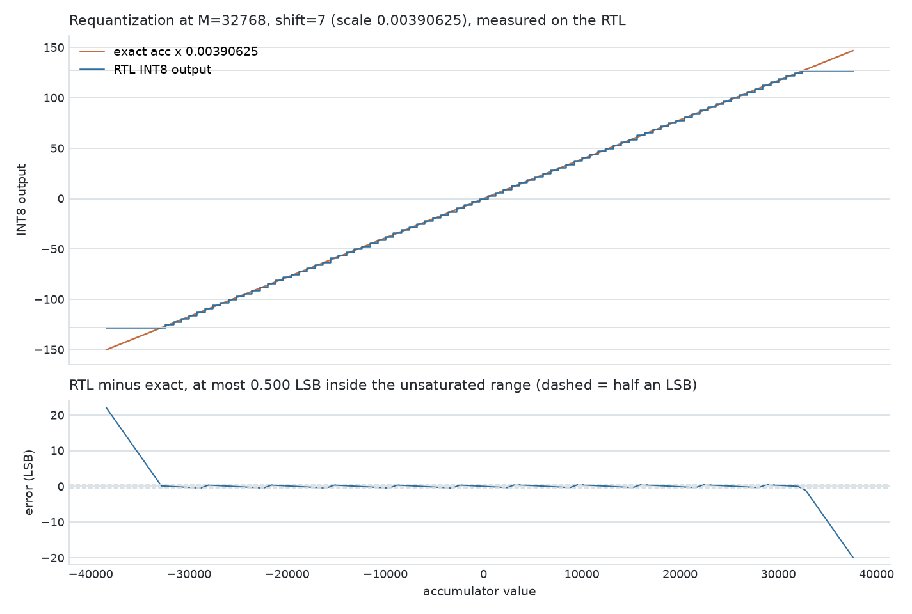
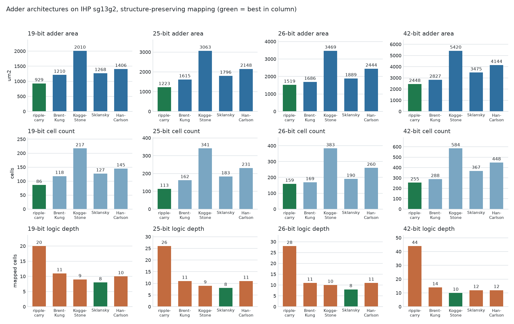
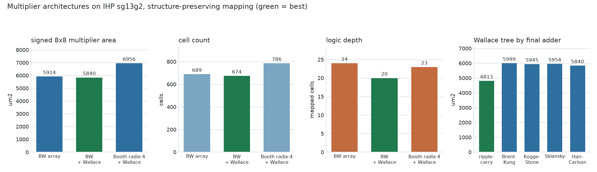
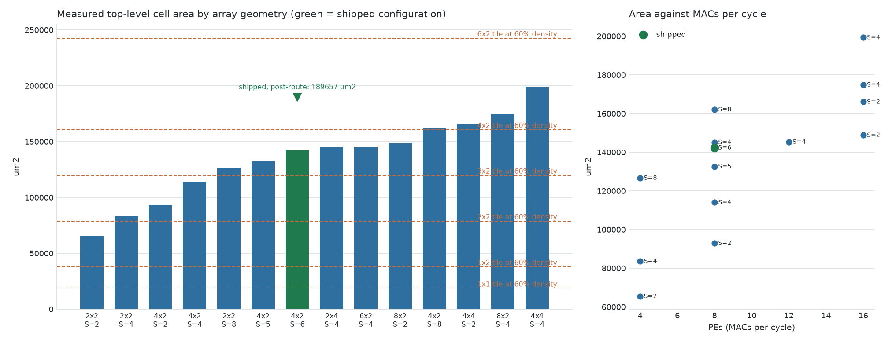
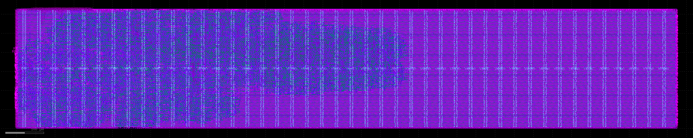
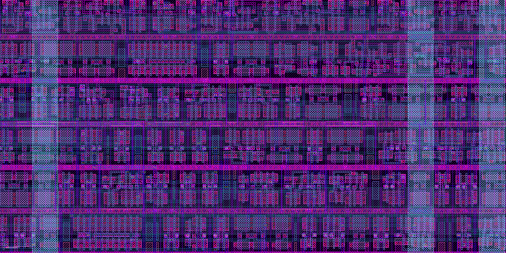
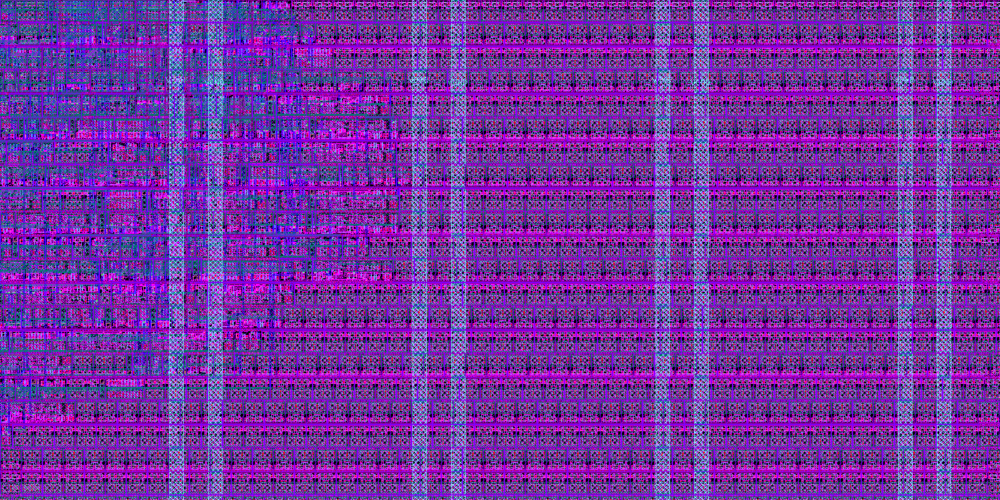
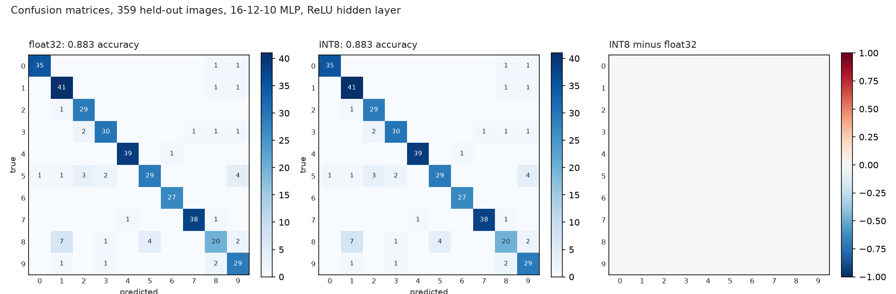
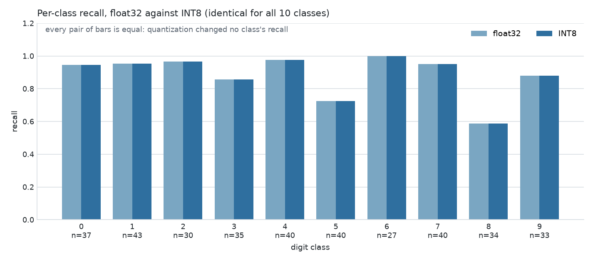
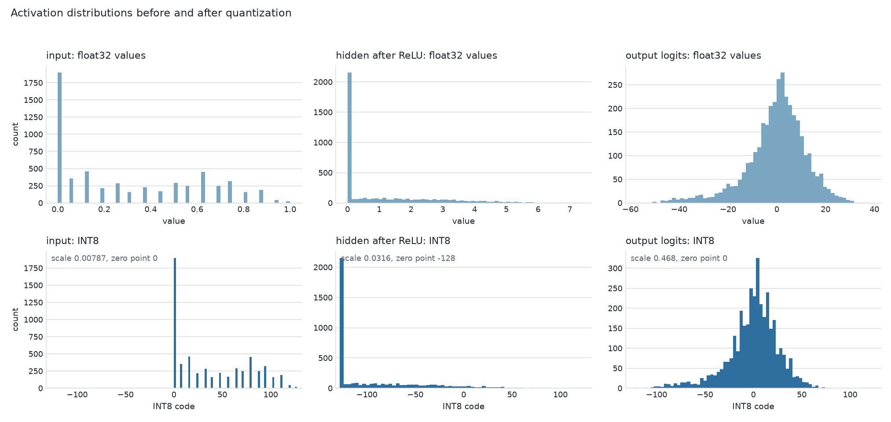

# tt-ihp-int8-npu

A signed INT8 neural-network inference accelerator for the
[Tiny Tapeout](https://tinytapeout.com) IHP 130 nm open-source PDK shuttle: a
weight-stationary systolic MAC array with a complete integer-only
requantization pipeline, driven over nine pins.

Everything here is measured rather than asserted. Synthesis areas come from
Yosys against the real IHP `sg13g2` liberty, the post-route area, timing and
signoff numbers come from a LibreLane run that reaches zero DRC and zero LVS
errors, every arithmetic architecture is formally proved equal to its behavioral
reference, and the figures are drawn from traces taken out of the running RTL.
It is a hardened layout, not silicon: fabrication would still go through a Tiny
Tapeout shuttle.


## What it is

| | |
| --- | --- |
| top module | `tt_um_danieltyukov_int8_npu` |
| array | 4 x 2 weight-stationary systolic PEs, 8 signed INT8 MACs per cycle |
| accumulators | 24-bit, bias-initialised, saturating, per output channel per sample |
| on-chip activations | 6 vectors of 4 elements |
| requantization | per-channel Q0.16 multiplier, rounding arithmetic shift, output zero point, INT8 saturation |
| activations | identity, ReLU, ReLU6, shift-based leaky ReLU, selectable at runtime |
| host interface | framed byte protocol, 12 opcodes, 4 readback sources, sticky error codes |
| synthesis area | 142403 um2 of standard cells (8118 cells, 1137 registers) |
| post-route area | 189657 um2 of standard cells in 11225 instances, 36.05% core utilization |
| tile | 8x2, a 1724.16 x 313.74 um die of 540938 um2 |
| hardening | 0 Magic DRC errors, 0 Netgen LVS errors, 0 routing DRC errors, 0 antenna violations |
| clock target | 40 MHz: +4.6 ns setup slack from OpenSTA after synthesis, +11.4 ns after routing, both at the slow corner |

The arithmetic is not a fixed netlist. Five adder architectures and three
multiplier architectures are parameterized generators, selected by a number,
and each one is formally proved equal to its behavioral reference over the
whole input space:

```systemverilog
npu_adder #(.WIDTH(25), .ARCH(4))   u_add (...);   // Han-Carlson
npu_mult  #(.A_W(8), .B_W(8), .MUL_ARCH(1), .ADD_ARCH(4)) u_mul (...);
```

## Contents

- [How it works](#how-it-works)
- [Command set](#command-set)
- [Status and error codes](#status-and-error-codes)
- [Quantization semantics](#quantization-semantics)
- [Arithmetic architecture comparison](#arithmetic-architecture-comparison)
- [Tile size](#tile-size)
- [Hardened layout](#hardened-layout)
- [Clock target](#clock-target)
- [End-to-end neural network demo](#end-to-end-neural-network-demo)
- [Verification](#verification)
- [Formal equivalence](#formal-equivalence)
- [Simulating and testing](#simulating-and-testing)
- [Repository layout](#repository-layout)
- [Which CI jobs can actually run](#which-ci-jobs-can-actually-run)
- [Using this as a template](#using-this-as-a-template)

## How it works

Each processing element holds one weight byte and keeps it. Activations stream
west to east one element per cycle, partial sums accumulate north to south, and
every PE performs one multiply-accumulate per cycle for as long as activations
keep arriving:

```
a_reg(r,c)    <= a_reg(r,c-1)
psum_reg(r,c) <= psum_reg(r-1,c) + w_reg(r,c) * a_reg(r,c)
```

Activations are read out of the buffer with a diagonal skew, row `r` seeing the
sample that entered row 0 `r` cycles earlier, which makes the wavefront and the
partial-sum chain line up with no extra skew registers. Column `c` emits its
finished dot product at the end of cycle `ROWS + c`, so results leave one column
per cycle.


One frame per clock cycle, taken from the running RTL by `test/test_trace.py`:
each PE shows its resident weight, the activation it is working on, and its
running partial sum.


The array phase is `S_COUNT + ROWS + COLS` cycles, of which `ROWS + 1` are fill
and `COLS - 1` are drain. Every PE performs exactly `S_COUNT` MACs with no gaps,
and all eight PEs hold a live activation simultaneously for
`S_COUNT - ROWS - COLS + 2` cycles: two, at the shipped `S_MAX = 6`.
`test_sustained_throughput` reads every PE's activation register every cycle and
asserts all of that, and `test_latency_matches_model` asserts the measured busy
time equals the documented model for every sample count.

Column sums land in the accumulator bank, which is initialised with the bias
exactly as a TFLite kernel is, saturates rather than wrapping, and accumulates
across passes. A layer with more inputs than the array has rows is computed as
several accumulating passes with a fresh weight tile between them, which is how
the demo network's 16-input layer runs on a 4-row array.

## Command set

A frame is one opcode byte with `is_cmd` high, then a fixed number of payload
bytes with `is_cmd` low. Frames may be spread over any number of idle cycles.
Payload lengths are fixed per opcode, which is what lets the interface detect
both a byte too many and a frame abandoned early.

| opcode | name | payload | effect |
| --- | --- | --- | --- |
| `0x0` | NOP | 0 | nothing |
| `0x1` | CFG | 1 | sample count minus one, clamped to `S_MAX-1` |
| `0x2` | LD_W | 8 | weight tile, row-major `W[0][0] .. W[3][1]` |
| `0x3` | LD_ACT | 24 | activations, sample-major, `S_MAX x ROWS` bytes |
| `0x4` | LD_BIAS | 6 | per channel, 24-bit little endian |
| `0x5` | LD_QUANT | 6 | per channel: `M` low byte, `M` high byte, shift |
| `0x6` | LD_POST | 4 | zero point, clamp low, clamp high, `{leaky_k[2:0], act_sel[1:0]}` |
| `0x7` | RUN | 0 | `arg[0]` accumulate, `arg[1]` requantize |
| `0x8` | RDSEL | 1 | `arg[1:0]` source, payload = start index |
| `0x9` | CLR | 0 | clear sticky flags and `done` |
| `0xA` | SRST | 0 | soft reset: accumulators, results, sequencer, flags |
| `0xF` | ID | 0 | select the identity block, reset the pointer |

`RUN` arguments compose. A single-pass layer is `0x72`; a three-pass layer is
`0x70`, `0x71`, `0x73`.

| `RDSEL` arg | source | length | format |
| --- | --- | --- | --- |
| 0 | results | 12 bytes | INT8, index `sample*COLS + channel` |
| 1 | raw accumulators | 48 bytes | INT32 little endian, 4 bytes per entry, index `((sample << 1) or channel) * 4` |
| 2 | status | 1 byte | see below |
| 3 | identity | 8 bytes | `'N'`, `'8'`, version, `{ROWS,COLS}`, `{S_MAX,0}`, `ACC_W`, `M_W`, `{MUL_ARCH,ADD_ARCH}` |

The identity block means host software can discover the geometry instead of
hard-coding it, which matters if you fork this and resize the array.


## Status and error codes

| pin | name | meaning |
| --- | --- | --- |
| `uio_in[0]` | wr | sample `ui_in` on this rising edge |
| `uio_in[1]` | is_cmd | 1 = opcode byte, 0 = payload byte |
| `uio_in[2]` | rd | advance the readback pointer |
| `uio_out[3]` | busy | a run is in progress |
| `uio_out[4]` | done | results are ready |
| `uio_out[5]` | err | sticky protocol error |
| `uio_out[6]` | sat | sticky, an output saturated at an INT8 rail |
| `uio_out[7]` | ovf | sticky, an accumulator saturated |

Status byte, `RDSEL` source 2: `{err_code[1:0], 0, ovf, sat, err, done, busy}`.

| code | meaning |
| --- | --- |
| 0 | no error |
| 1 | unknown opcode |
| 2 | a write was attempted while busy |
| 3 | frame length violation: a payload byte too many, or a frame abandoned early |

Writes during `busy` are **rejected, not queued**. That is a deliberate choice:
queueing would need a buffer and a stall path for a case a host can trivially
avoid by polling one pin. `CLR` clears all sticky bits.

## Quantization semantics

The hardware implements the standard integer-only affine path. With per-channel
symmetric INT8 weights and per-tensor INT8 activations:

```
acc[c]  = bias[c] + sum_r q_x[r] * q_w[r][c]     exact, saturating at 24 bits
n       = M_W + shift[c]
p       = acc[c] * M[c]                          exact
y       = (p >>> n) + round_up                   round to nearest, ties away from zero
q_y[c]  = saturate_int8(y + zero_point)
out[c]  = activation(q_y[c])
```

`round_up` comes from the round bit (bit `n-1` of `p`) and the sticky OR of
everything below it:

```
round_up = (p >= 0) ? R : (R and S)
```

which is exactly gemmlowp's `RoundingDivideByPOT`, the rule TFLite uses for
per-tensor requantization, and `test_rounding_ties` checks it at the `.5`
boundary in both directions.

**Where this differs from TFLite.** TFLite splits the multiply into
`SaturatingRoundingDoublingHighMul` with a Q0.31 multiplier followed by
`RoundingDivideByPOT`, so it rounds twice and carries 31 bits of scale. This
design uses one Q0.`M_W` multiplier and rounds once. The arithmetic is exact for
the multiplier it is given; what differs is the precision of the scale itself,
bounded by a relative error of `2^-M_W`, which is `1.5e-5` at the default
`M_W = 16`. The measured cost of more precision is in
[docs/img/requant_width.png](docs/img/requant_width.png): `M_W = 24` costs about
1400 um2 and four more cycles per output. On the demo network INT8 accuracy is
identical to float32, so 16 bits is not the limiting factor there.

**Input zero points** are supported without any hardware for them. The expansion

```
sum_r (q_x[r] - z_x) * q_w[r][c] = sum_r q_x[r] q_w[r][c] - z_x sum_r q_w[r][c]
```

shows the correction is a per-channel constant, so it is folded into the bias
offline, which is what a quantizing compiler does anyway. The demo's second
layer consumes the first layer's ReLU output with its zero point at -128 exactly
this way.

### Worked example

`W = [[1,2],[3,4],[5,6],[7,8]]`, `x = [1,1,1,1]`, `bias = [0, 100]`,
`M = 0x8000`, `shift = 0`, `zero_point = 0`:

```
column 0: acc = 0 + (1+3+5+7) = 16
          p = 16 * 32768 = 524288,  n = 16
          p >> 16 = 8,  R = bit 15 = 0,  S = 0,  round_up = 0
          q = 8

column 1: acc = 100 + (2+4+6+8) = 120
          p = 120 * 32768 = 3932160
          p >> 16 = 60,  R = 0,  S = 0
          q = 60
```

and a tie, `acc = 3` with the same scale of exactly 1/2:

```
p = 98304,  p >> 16 = 1,  R = bit 15 = 1,  S = 0
p >= 0 so round_up = R = 1,  q = 2         (1.5 rounds away from zero)
acc = -3: p >>> 16 = -2, R = 1, S = 0, round_up = R and S = 0, q = -2
```

Both cases are `test_directed_layer` and `test_rounding_ties` in the suite.

### Requantizer accuracy against the exact real-valued result



Measured on the RTL by sweeping the accumulator across the range that maps to
the whole INT8 output range: the hardware is the correctly rounded result of the
exact product at every point, so the error never exceeds half an LSB inside the
unsaturated range.

## Arithmetic architecture comparison

Both reference designs this project supersedes depend on machine-generated
arithmetic netlists and never compare them. Here every architecture is a
readable generator, and all of them are measured.

The comparison uses **structure-preserving mapping** (`abc -fast`), so what gets
measured is the architecture the generator describes. `docs/synth/ppa.md` also
reports the numbers under ABC's full resynthesis, which is what the hardening
flow runs and which partly erases the differences: worth knowing before
optimizing an adder by hand.

<!--PPA_ADDERS-->
25-bit adders, the width of the accumulator path:

| architecture | cells | area (um2) | logic depth |  |
| --- | --- | --- | --- | --- |
| ripple-carry | 113 | 1223 | 26 | smallest |
| Brent-Kung | 162 | 1615 | 11 |  |
| Kogge-Stone | 341 | 3063 | 9 |  |
| Sklansky | 183 | 1796 | 8 | shortest path |
| Han-Carlson | 231 | 2148 | 11 |  |

<!--PPA_MULTS-->
Signed 8x8 multipliers, the width every PE instantiates:

| architecture | cells | area (um2) | logic depth |  |
| --- | --- | --- | --- | --- |
| Baugh-Wooley array | 689 | 5914 | 24 |  |
| Baugh-Wooley + Wallace | 674 | 5840 | 20 | smallest, shortest path |
| Booth radix-4 + Wallace | 786 | 6956 | 23 |  |

The same Wallace tree with each final carry-propagate adder, which shows the two choices are independent:

| final adder | cells | area (um2) | logic depth |
| --- | --- | --- | --- |
| ripple-carry | 534 | 4813 | 23 |
| Brent-Kung | 675 | 5999 | 20 |
| Kogge-Stone | 677 | 5945 | 19 |
| Sklansky | 675 | 5954 | 18 |
| Han-Carlson | 674 | 5840 | 20 |





The ordering is the textbook one, which is a useful check that the generators
really describe the networks they claim to: ripple-carry is smallest and
deepest, Kogge-Stone is shallowest and largest, Brent-Kung sits between them,
Sklansky matches Kogge-Stone's depth with far fewer cells by concentrating
fanout, and Han-Carlson gets Kogge-Stone's depth plus one for about half its
wiring. Full tables, including all four widths and both mapping efforts, are in
[docs/synth/ppa.md](docs/synth/ppa.md).

The shipped configuration uses `ADD_ARCH=4` (Han-Carlson) and `MUL_ARCH=1`
(Baugh-Wooley partial products with a Wallace tree).

## Tile size

<!--PPA_SCALING-->
Every geometry below was synthesized and measured, not estimated:

The last two columns apply the 60% criterion twice: once to the Yosys cell area, and once to that area scaled by 1.33, which is the synthesis-to-post-route cell area ratio measured on the shipped configuration. Only the shipped row has been hardened, so the scaled column is an extrapolation from that one data point.

| array | S_MAX | MACs/cycle | cells | synth area (um2) | registers | depth | smallest tile, synth area | smallest tile, x1.33 route |  |
| --- | --- | --- | --- | --- | --- | --- | --- | --- | --- |
| 2x2 | 2 | 4 | 3918 | 65508 | 554 | 35 | 2x2 at 49.8% | 3x2 at 43.7% |  |
| 2x2 | 4 | 4 | 4705 | 83687 | 723 | 35 | 3x2 at 41.9% | 3x2 at 55.8% |  |
| 4x2 | 2 | 8 | 5899 | 92995 | 733 | 32 | 3x2 at 46.5% | 4x2 at 46.2% |  |
| 4x2 | 4 | 8 | 6718 | 114070 | 935 | 29 | 3x2 at 57.1% | 4x2 at 56.7% |  |
| 2x2 | 8 | 4 | 6604 | 126700 | 1051 | 38 | 4x2 at 47.3% | 6x2 at 41.7% |  |
| 4x2 | 5 | 8 | 7785 | 132631 | 1041 | 34 | 4x2 at 49.5% | 6x2 at 43.7% |  |
| **4x2** | 6 | 8 | 8118 | 142403 | 1137 | 35 | 4x2 at 53.1% | 6x2 at 46.9% | shipped |
| 2x4 | 4 | 8 | 7966 | 145147 | 1215 | 29 | 4x2 at 54.1% | 6x2 at 47.8% |  |
| 6x2 | 4 | 12 | 8896 | 145372 | 1145 | 29 | 4x2 at 54.2% | 6x2 at 47.9% |  |
| 8x2 | 2 | 16 | 9826 | 148825 | 1099 | 31 | 4x2 at 55.5% | 6x2 at 49.0% |  |
| 4x2 | 8 | 8 | 8788 | 162109 | 1329 | 35 | 6x2 at 40.1% | 6x2 at 53.4% |  |
| 4x4 | 2 | 16 | 10665 | 166112 | 1237 | 29 | 6x2 at 41.1% | 6x2 at 54.7% |  |
| 8x2 | 4 | 16 | 10751 | 174925 | 1369 | 29 | 6x2 at 43.2% | 6x2 at 57.6% |  |
| 4x4 | 4 | 16 | 11778 | 199360 | 1569 | 29 | 6x2 at 49.3% | 3x4 at 58.7% |  |



The criterion is cell area at or below 60% of the die area, matching
`PL_TARGET_DENSITY_PCT` in `src/config.json`. Die areas come from the
`tt_block_<tile>_pgvdd.def` floorplan templates the hardening flow applies, so
the 8x2 die is 1724.16 x 313.74 um, or 540938 um2. The shipped configuration
synthesizes to **142403 um2**, 26.3% of that die.

Synthesis area is not what the tile has to hold. Placement and routing insert
2450 timing-repair buffers and 1395 hold buffers, and the design arrives at
signoff with **189657 um2** of standard cells, 1.33 times the Yosys figure.
Against the 60% criterion that rules out a 4x2 tile, where the routed design
would sit at 70.8%, and leaves 6x2 at 46.9% as the smallest tile that meets it.

The shipped tile is 8x2, one size larger, and the final placement says so
plainly: every standard cell in the design sits at x <= 1023.4 um, so the right
700 um of the die holds nothing but decap fill. 8x2 was chosen from a tile table
that turned out to be wrong; the numbers above are the corrected ones. What the
extra tile buys is routing margin, and this design used it: detailed routing
started at 3297 DRC violations and needed five iterations to reach zero.
[The 6x2 hardening](#the-6x2-alternative) below is the measurement of what
happens without that margin.

This is a large project by Tiny Tapeout standards, and the reason is registers
rather than arithmetic. A resettable flip-flop in sg13g2 is 48.99 um2 and a
2:1 multiplexer is 18.14 um2, so a flip-flop that needs an enable costs 67 um2,
more than a full adder bit. Of the 1137 registers, 576 exist purely to keep the
array fed: 192 bits of activation buffer, 288 bits of accumulator bank and 96
bits of result register. That is the real cost of a systolic array on a tile with
no SRAM, and it is why area grows faster with `S_MAX` than with the array itself.

Two calibration points, measured with the same flow, for anyone weighing that
number: the two IHP projects this one supersedes synthesize to 7006 um2 (22.4%
of a 1x1 tile) and 65111 um2 (49.5% of a 2x2 tile).

Smaller configurations, all measured, for forks that want cheaper silicon. The
routed column scales the synthesis area by the 1.33 factor measured on the
shipped configuration, which is an extrapolation from one hardened point:

| configuration | MACs/cycle | synth area | tile at 60%, synth | tile at 60%, x1.33 |
| --- | --- | --- | --- | --- |
| `ROWS=4 COLS=2 S_MAX=6` (shipped) | 8 | 142403 um2 | 4x2, 53.1% | 6x2, 46.9% |
| `ROWS=4 COLS=2 S_MAX=5` | 8 | 132630 um2 | 4x2, 49.5% | 6x2, 43.7% |
| `ROWS=4 COLS=2 S_MAX=4` | 8 | 114070 um2 | 3x2, 57.1% | 4x2, 56.7% |
| `ROWS=2 COLS=2 S_MAX=4` | 4 | 83686 um2 | 3x2, 41.9% | 3x2, 55.8% |
| `ROWS=2 COLS=2 S_MAX=2` | 4 | 65508 um2 | 2x2, 49.8% | 3x2, 43.7% |

`S_MAX >= ROWS + COLS - 1` is what makes a cycle in which every PE is busy
possible, which is why the shipped configuration keeps `S_MAX = 6`.

## Hardened layout

The design hardens end to end in the Tiny Tapeout `gds` workflow: LibreLane
takes the RTL through synthesis, floorplanning, placement, CTS, routing and
signoff against the IHP `sg13g2` PDK. This is a hardened layout, not silicon.
Nothing here has been fabricated, and a shuttle submission still has to go
through Tiny Tapeout.

<!--PNR_RESULTS-->
Signoff metrics from the `gds` workflow, run [30171991004](https://github.com/danieltyukov/tt-ihp-int8-npu/actions/runs/30171991004), hardened with LibreLane 3.0.0.dev44 against `ihp-sg13g2` at PDK commit `cb7daaa89010`. Copied verbatim into [docs/pnr/metrics.json](docs/pnr/metrics.json) by `scripts/harvest_pnr.py`.

|  |  |
| --- | --- |
| die | 1724.16 x 313.74 um, 540938 um2 (8x2 tile) |
| standard cells | 189657 um2 in 11225 instances |
| core utilization | **36.05%** |
| cell area vs the die | 35.06% |
| decap and fill | 336482 um2 in 31301 instances |
| registers | 1137 |
| buffers inserted for timing repair | 2450 |
| buffers inserted for hold | 1395 |
| clock buffers and inverters | 206 + 14 |
| logic placed between | x = 2.88 um and x = 1023.36 um, 59.2% of the die width |
| routed wirelength | 398341 um |
| setup slack, slow corner (1.08 V, 125 C) | **+11.40 ns** at a 25 ns period |
| hold slack, fast corner (1.32 V, -40 C) | +0.106 ns |
| worst clock skew, setup | 0.392 ns |
| Magic DRC errors | **0** |
| Netgen LVS errors | **0** |
| detailed-route DRC errors | **0** |
| antenna violations | 0 |
| total power estimate | 9.8 mW |



The whole 1724.16 x 313.74 um die. The regularly spaced vertical stripes are
the power straps at the 38.87 um PDN pitch, not array structure: LibreLane
flattens the module hierarchy during synthesis and renames every cell, so
nothing in the layout is grouped by processing element and the systolic
structure is not visible here. It is visible in the architecture diagram and in
the dataflow figure, both of which come from the RTL.



A 44 x 22 um crop, about 0.3% of the die. Six standard-cell rows, each with its
own VDD and VSS rails, individual cells with their diffusion and poly, the
routing above them, and two power straps crossing vertically.



A 160 x 80 um crop across x = 1023 um, where the design ends. Irregular logic
cells on the left, the strict repeating pattern of identical decap fill cells
on the right. This is the picture of the 8x2 tile being larger than the design
needs.

### The 6x2 alternative

<!--TILE_6X2-->
_Pending: the same RTL hardened at 6x2, measured on the
`experiment/tile-6x2` branch._

## Clock target

`clock_hz` is 40 MHz, and that number comes from OpenSTA on the mapped netlist
against the IHP `sg13g2` liberty, not from an estimate. `make sta` reproduces it
and writes [docs/synth/sta_typ.txt](docs/synth/sta_typ.txt) and
[docs/synth/sta_slow.txt](docs/synth/sta_slow.txt).

| corner | worst setup slack at 25 ns | critical path | implied Fmax |
| --- | --- | --- | --- |
| fast, 1.32 V, -40 C | +15.180 ns | 9.82 ns | 101.8 MHz |
| typical, 1.20 V, 25 C | +11.246 ns | 13.75 ns | 72.7 MHz |
| slow, 1.08 V, 125 C | +4.598 ns | 20.40 ns | 49.0 MHz |

The critical path is one 8x8 signed multiply followed by a 19-bit add inside a
PE, 35 mapped cells deep. Wire parasitics are not modelled here (there is no
placement yet), so these are the cell-delay component only: at the slow corner
40 MHz leaves 4.6 ns, about 18% of the period, for interconnect and clock tree.
50 MHz would leave -0.4 ns at that corner before any wire delay at all, which is
why the target is 40 and not the template's 50.

Hold slack is +0.073 ns at the slow corner and -0.102 ns at the fast corner with
0.25 ns of assumed clock uncertainty, which is the ordinary starting point for a
flow that inserts hold buffers during placement.
[docs/ADAPTING.md](docs/ADAPTING.md) describes the two ways to go faster.

## End-to-end neural network demo

A 16-12-10 multilayer perceptron over 4x4 handwritten digit images, trained in
float32 with NumPy alone and quantized to the exact integer pipeline the
hardware implements, then executed layer by layer on the RTL: weight tiles
streamed in, activations batched, `K > ROWS` handled by accumulating passes, and
the requantized INT8 activations of layer 1 fed back in as the input to layer 2.

<!--DEMO_RESULTS-->
|  |  |
| --- | --- |
| network | 16-12-10 MLP, ReLU hidden layer |
| dataset | UCI hand-written digits (scikit-learn load_digits), 2x2 mean pooled to 4x4 |
| train / test images | 1438 / 359 |
| float32 accuracy | **0.8830** |
| INT8 accuracy | **0.8830** |
| accuracy change from quantization | +0.0000 |
| layer 1 accumulator range | -41947 .. 31086 |
| layer 2 accumulator range | -39540 .. 36361 |
| input quantization | scale 0.00787402, zero point 0 |
| hidden quantization | scale 0.0315701, zero point -128 |
| output quantization | scale 0.468215, zero point 0 |







Dataset: scikit-learn's `load_digits`, which is the UCI hand-written digits set,
2x2 mean pooled from 8x8 to 4x4. The pooled copy and the quantized model are
committed under `test/data/`, so the demo runs with no network access and
without scikit-learn installed.

## Verification

Nothing in the suite is a smoke test. Every result is compared against
`test/golden.py`, an independent Python model of the quantization semantics
written from the datasheet, in plain Python integers so overflow behaviour is
never in doubt.

Coverage worth calling out:

- **Randomized golden-model sweep**: 40 randomized layer configurations (random
  weights, activations, biases, multipliers, shifts, zero points, activation
  modes and clamp windows), checking all 310 INT8 outputs and all 310 raw
  accumulators bit-exactly.
- **Multi-pass reduction**: 12 layers over 32 accumulating passes, up to 16
  inputs on a 4-row array.
- **`-128` everywhere**: the asymmetric INT8 minimum in weights and activations,
  including `-128 * -128 = 16384`, which needs the full 16-bit product.
- **Both saturation rails**, accumulator overflow in both directions, and that
  the sticky flags latch and clear.
- **Rounding exactly at the `.5` boundary**, both signs, plus a cross-check of
  the two formulations of the rounding rule over 8192 values.
- **Zero and maximum scales**: `M = 0`, `M = 2^16-1`, maximum shift, `M = 1`,
  crossed with zero points at both INT8 rails.
- **Arithmetic-variant equivalence**: every adder and multiplier architecture
  bit-identical to every other. The cocotb sweep covers 4096 signed 8x8 operand
  pairs across eight variants; `make arith` covers all 65536 exhaustively; and
  [formal equivalence](#formal-equivalence) proves the same thing over the whole
  input space rather than sampling it.
- **Sustained throughput** measured on the PE registers themselves, not inferred
  from a cycle count: every PE performs exactly 6 MACs with no gaps and all 8 are
  simultaneously busy for 2 cycles.
- **Protocol**: unknown opcodes, payload overrun, abandoned frames, writes while
  busy, and that the interface resynchronizes afterwards.
- **Reset**: outputs defined and deterministic after reset, and mid-run reset
  returning to a known state.

Results from the last full run:

<!--TEST_RESULTS-->
| results file | tests | passed | failed |
| --- | --- | --- | --- |
| `results.xml` | 21 | 21 | 0 |
| `results_arith.xml` | 4 | 4 | 0 |
| `results_demo.xml` | 1 | 1 | 0 |
| `results_trace.xml` | 3 | 3 | 0 |
| **total** | 29 | 29 | 0 |

Produced by `make test-all` on this machine with Icarus Verilog 12.0 and cocotb 2.0.1.

## Formal equivalence

<!--FORMAL_RESULTS-->
`scripts/run_formal.py` proves each arithmetic variant equal to its behavioral reference: `a + b + cin` for adders, `a * b` for multipliers. Engine: SymbiYosys bmc, smtbmc z3, depth 1. A pass is therefore a correctness proof over the whole input space, not an agreement check between two implementations, and it is what makes the area and depth differences in the PPA tables the only differences.

**35 of 35 proofs pass**, 488s of wall time. Full table in [docs/formal/summary.md](docs/formal/summary.md).

| what is proved | variants | inputs per proof | result |
| --- | --- | --- | --- |
| `npu_adder` equals `a + b + cin` | 5 architectures x 19, 25, 26 and 42 bits | 2**39 to 2**85 | 20/20 pass |
| `npu_mult` equals `a * b` | 3 partial-product styles x 5 final adders | all 65536 signed 8x8 pairs | 15/15 pass |

## Simulating and testing

```
make venv        # .venv with cocotb 2.0.1, numpy, matplotlib, pillow
make lint        # verilator --lint-only -Wall on every module, silent
make arith       # exhaustive iverilog arithmetic bench, no venv needed
make test        # cocotb accelerator suite
make test-all    # plus variant equivalence and the end-to-end NN demo
make formal      # SymbiYosys proofs for every adder and multiplier variant
make ppa         # full PPA comparison, writes docs/synth/ppa.md
make images      # regenerate every figure from measured data
```

`make formal` needs `sby` and `z3`; the adder proofs finish in a second each and
the multiplier proofs in one to two minutes each. `--jobs` sets how many solvers
run at once, defaulting to the core count minus two and capped at four.

Measured runtimes on this machine (Icarus 12.0, roughly 250 to 500 ns of
simulation per second on this design): the accelerator suite is about 25 minutes,
the arithmetic suite a few minutes, the end-to-end demo about 20 minutes, and the
standalone `make arith` bench about two. `NODUMP=1` skips the waveform dump and
is what those numbers were taken with. `NPU_SWEEP_CASES`, `NPU_MULTIPASS_CASES`,
`NPU_ARITH_STRIDE` and `NPU_DEMO_IMAGES` scale the four long loops up or down.

cocotb 2.0.1 needs Verilator 5.036 or newer to use it as a backend and 5.020 is
what is installed here, so Icarus is the default.

Area numbers need the IHP standard-cell liberty, which is not vendored:

```
git clone --depth 1 https://github.com/IHP-GmbH/IHP-Open-PDK
cp IHP-Open-PDK/ihp-sg13g2/libs.ref/sg13g2_stdcell/lib/sg13g2_stdcell_typ_1p20V_25C.lib pdk/
```

## Repository layout

```
src/
  npu_adder.sv              5 adder architectures, one prefix skeleton
  npu_csa_reduce.sv         recursive Wallace carry-save reduction tree
  npu_pp_baugh_wooley.sv    signed partial products, constant-row form
  npu_pp_booth4.sv          radix-4 Booth recoding
  npu_mult.sv               3 multiplier architectures
  npu_pe.sv                 one processing element
  npu_array.sv              the systolic array and its weight chain
  npu_requant.sv            serial Booth multiply, rounding shift, zero point
  npu_activation.sv         identity, ReLU, ReLU6, leaky ReLU
  npu_host_if.sv            framed byte protocol and error reporting
  npu_core.sv               storage, sequencer, accumulator bank, readback
  tt_um_danieltyukov_int8_npu.sv   pin mapping and the shipped parameters
test/
  golden.py                 independent INT8 reference model
  npu_driver.py             cocotb driver for the pin protocol
  test_npu.py               accelerator suite
  test_arith.py             arithmetic-variant equivalence
  test_demo.py              end-to-end neural network demo
  test_trace.py             captures the data behind the figures
  tb_arith.sv               exhaustive standalone arithmetic bench
  data/                     committed dataset and quantized demo model
formal/
  miter_adder.sv            npu_adder against a + b + cin
  miter_mult.sv             npu_mult against a * b
scripts/                    synthesis, PPA, formal, training, figures, rendering
docs/
  DESIGN.md                 architecture, mathematics, cost models, area budget
  ADAPTING.md               how to fork this: resize, swap the layer, add a
                            variant, retarget the tile
  info.md                   Tiny Tapeout datasheet page
  synth/ppa.md              full measured PPA tables
  pnr/metrics.json          signoff metrics from the hardening run, verbatim
  pnr/placement.json        die box and cell extent from the final DEF
  formal/summary.md         every proof, its input space and its solver time
  img/                      every figure, all generated by committed scripts
```

## Which CI jobs can actually run

| workflow | runs here | notes |
| --- | --- | --- |
| `test` | yes | lint, accelerator suite, variant equivalence, NN demo |
| `docs` | needs TT infrastructure | uses `TinyTapeout/tt-gds-action/docs` |
| `gds` | needs TT infrastructure | hardening, precheck, gate-level test and the GDS viewer all run inside Tiny Tapeout's action against the shuttle's PDK setup |
| `fpga` | needs TT infrastructure | disabled by default in the template |

The `gds`, `docs` and `fpga` jobs are included because a shuttle submission needs
them, but they depend on Tiny Tapeout's own tooling and cannot be validated
outside it, so there are no badges for them here. The checks that would otherwise
stay invisible until hardening (area, logic depth, inferred latches, unmapped
cells) are done locally instead, by `make ppa`.

## Using this as a template

Fork it, change the parameters on the top module, and re-run the measurements.
[docs/ADAPTING.md](docs/ADAPTING.md) covers resizing the array, retargeting the
tile, swapping in a different quantized layer, and the exact interface a new
adder or multiplier architecture has to implement to join the equivalence tests
and the PPA sweep.

## License

Apache-2.0, copyright 2026 Daniel Tyukov. See [LICENSE](LICENSE).
