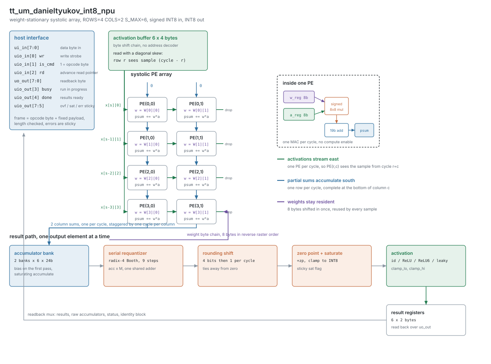
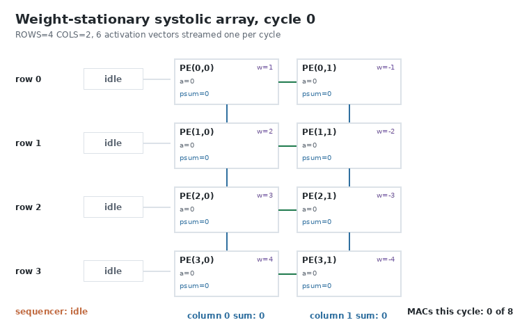
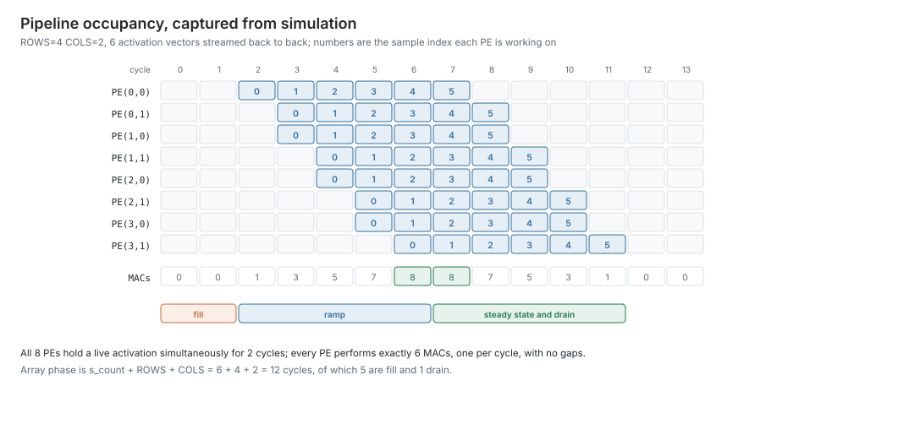
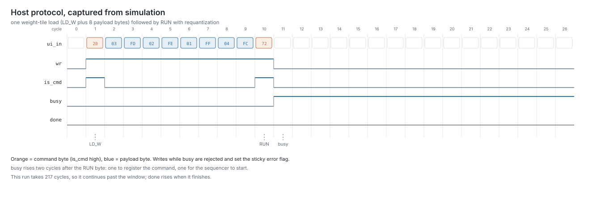

## Signed INT8 Systolic NPU with TFLite-style Requantization

A 4x2 weight-stationary systolic array of signed INT8 multiply-accumulate cells
with a complete integer-only requantization pipeline: per-channel fixed-point
scales, correctly rounded arithmetic shift, output zero point, INT8 saturation
and four runtime-selectable activation functions. Eight MACs per cycle at full
rate, driven over nine pins.



### How it works

**The array.** `ROWS x COLS = 4 x 2` processing elements. Each holds one weight
byte, and that weight stays put: activations stream west to east one element per
cycle, partial sums accumulate north to south, and every PE performs one MAC per
cycle for as long as activations keep arriving.

```
psum_reg(r,c) <= psum_reg(r-1,c) + w_reg(r,c) * a_reg(r,c)
a_reg(r,c)    <= a_reg(r,c-1)
```

Activations are read from the on-chip buffer with a diagonal skew, row `r` seeing
the sample that entered row 0 `r` cycles earlier, which makes the wavefront and
the partial-sum chain line up without any extra skew registers. Column `c` of the
array emits its complete dot product at the end of cycle `ROWS + c`, so results
leave one column per cycle.



The animation above is one frame per clock cycle, taken from the running RTL:
each PE shows its resident weight, the activation it is working on and its
running partial sum.

**Accumulation.** Column sums land in a bank of `COLS` accumulators per sample,
24 bits wide, initialised with the bias exactly as a TFLite kernel does, with
saturating accumulate and a sticky overflow flag. A layer with more than `ROWS`
inputs is computed as several accumulating passes with a fresh weight tile
between them, which is how the demo network's 16-input layer runs on a 4-row
array.

**Requantization.** A shared serial unit applies the standard integer-only
affine path:

```
n = M_W + shift
p = acc * M                             exact
y = (p >>> n) + round_up                round to nearest, ties away from zero
q = saturate_int8(y + zero_point)
```

with `round_up` derived from the round bit (bit `n-1` of `p`) and the sticky OR
of everything below it, which is exactly gemmlowp's `RoundingDivideByPOT`, the
rule TFLite uses. `M` is an unsigned 16-bit multiplier, per output channel, and
`shift` is a 5-bit right shift, so the representable effective scale is
`M / 2^(16+shift)`. The multiply is a radix-4 Booth loop sharing one adder with
the zero-point addition, because a parallel 24x16 multiplier would cost four
processing elements.

**Activations**, all relative to the output zero point:

| select | function |
| --- | --- |
| 0 | identity, clamped to `[clamp_lo, clamp_hi]` |
| 1 | ReLU, `max(q, zp)` |
| 2 | ReLU6, `clamp(q, zp, clamp_hi)` with `clamp_hi = quantize(6.0)` |
| 3 | leaky ReLU, slope `2^-k` below the zero point |

### Command set

Nine pins carry a framed byte protocol. A frame is one opcode byte with
`is_cmd` high, followed by a fixed number of payload bytes with `is_cmd` low.
Frames may be spread over any number of idle cycles.

| opcode | name | payload | effect |
| --- | --- | --- | --- |
| `0x0` | NOP | 0 | nothing |
| `0x1` | CFG | 1 | sample count minus one (clamped to `S_MAX-1`) |
| `0x2` | LD_W | 8 | weight tile, row-major `W[0][0] .. W[3][1]` |
| `0x3` | LD_ACT | 24 | activations, sample-major, `S_MAX x ROWS` bytes |
| `0x4` | LD_BIAS | 6 | per channel, 24-bit little endian |
| `0x5` | LD_QUANT | 6 | per channel: `M` low, `M` high, shift |
| `0x6` | LD_POST | 4 | zero point, clamp low, clamp high, `{leaky_k[2:0], act_sel[1:0]}` |
| `0x7` | RUN | 0 | `arg[0]` accumulate, `arg[1]` requantize |
| `0x8` | RDSEL | 1 | `arg[1:0]` source, payload = start index |
| `0x9` | CLR | 0 | clear the sticky flags and `done` |
| `0xA` | SRST | 0 | soft reset: accumulators, results, sequencer, flags |
| `0xF` | ID | 0 | select the identity block and reset the pointer |

`RUN` arguments compose: `0x70` starts a first pass without requantizing, `0x71`
accumulates onto the existing accumulators, `0x73` accumulates and requantizes,
`0x72` is a single-pass layer.

Readback sources for `RDSEL`:

| arg | source | length | format |
| --- | --- | --- | --- |
| 0 | results | 12 bytes | INT8, index `sample*COLS + channel` |
| 1 | raw accumulators | 48 bytes | INT32 little endian, 4 bytes per entry, index `((sample << 1) or channel) * 4` |
| 2 | status | 1 byte | see below |
| 3 | identity | 8 bytes | `'N'`, `'8'`, version, `{ROWS,COLS}`, `{S_MAX,0}`, `ACC_W`, `M_W`, `{MUL_ARCH,ADD_ARCH}` |

`uo_out` continuously presents the byte at the read pointer; raising `rd`
advances the pointer.

### Status

| pin | name | meaning |
| --- | --- | --- |
| `uio_out[3]` | busy | a run is in progress; writes are rejected |
| `uio_out[4]` | done | results are ready |
| `uio_out[5]` | err | sticky protocol error |
| `uio_out[6]` | sat | sticky, an output saturated at an INT8 rail |
| `uio_out[7]` | ovf | sticky, an accumulator saturated |

The status byte (`RDSEL` source 2) is
`{err_code[1:0], 0, ovf, sat, err, done, busy}` with error codes 1 unknown
opcode, 2 write while busy, 3 frame length violation. `CLR` clears them.

### Timing

| phase | cycles |
| --- | --- |
| array | `S_COUNT + ROWS + COLS`, of which `ROWS+1` fill and `COLS-1` drain |
| requantize | `NDIG + floor(n/4) + n mod 4 + 3` per output, `n = M_W + shift + 1` |

At `S_COUNT = 6` that is 12 cycles for 48 MACs, then 17 cycles per output
element at `shift = 0`. `busy` falls when everything is complete.





### How to test

Minimal single-pass layer, computing `y = W^T x` with an effective scale of 1/2:

1. Release `rst_n`.
2. `0x10`, `0x00`: one sample.
3. `0x20`, then `01 02 03 04 05 06 07 08`: the weight tile.
4. `0x30`, then 24 bytes with `01 01 01 01` first: activations.
5. `0x40`, then six zero bytes: no bias.
6. `0x50`, then `00 80 00 00 80 00`: `M = 0x8000`, `shift = 0` on both channels.
7. `0x60`, then `00 80 7F 00`: zero point 0, clamps at the INT8 rails, identity.
8. `0x72`: run with requantization. Wait for `busy` to fall.
9. `0x80`, `0x00`, then raise `rd` twice: `uo_out` reads 8 then 60.

Column 0 sums `1+3+5+7 = 16` and column 1 sums `2+4+6+8 = 20`, halved to 8 and
10; with a bias of 100 on channel 1 the second result becomes 60. That exact case
is `test_directed_layer` in the suite.

`0xF0` followed by `rd` pulses reads the identity block, which is the quickest
way to confirm the part is alive and to discover its geometry.

### Verification

Everything is checked against `test/golden.py`, an independent Python model of the
quantization semantics. The suite covers `-128` in every operand position, both
saturation rails, accumulator overflow, rounding exactly at the `.5` boundary in
both directions, zero and maximum scales, all four activations, protocol errors,
readback, reset behaviour, a randomized sweep of layer configurations, sustained
one-MAC-per-PE-per-cycle throughput measured on the PE registers themselves, and
a quantized 16-12-10 MLP run end to end on the RTL.

The adders and multipliers are parameterized generators rather than fixed
netlists, and each one is formally proved equal to its behavioral reference with
SymbiYosys: all five adder architectures against `a + b + cin` at 19, 25, 26 and
42 bits, and all three multiplier architectures against `a * b` over every one
of the 65536 signed 8x8 operand pairs, crossed with all five final adders. 35
proofs, all passing, listed in `docs/formal/summary.md`. Measured area and logic
depth for every variant, and for thirteen array geometries, are in
`docs/synth/ppa.md`.

The design hardens end to end with LibreLane on `sg13g2`: 190566 um2 of standard
cells at 48.5% core utilization on the 6x2 tile, zero Magic DRC errors, zero
Netgen LVS errors, zero routing DRC errors and +12.5 ns of setup slack at the
slow corner. The tile size was settled by hardening 4x2, 6x2 and 8x2 to signoff
and comparing, not by scaling the synthesis area: all three pass, and 6x2 has the
best slack and the shortest routed wirelength of the three. Signoff metrics for
all of them are in `docs/pnr/`. That is a hardened layout, not fabricated
silicon.

### External hardware

None. Any microcontroller or FPGA that can drive nine pins can load a layer and
read the results back.
